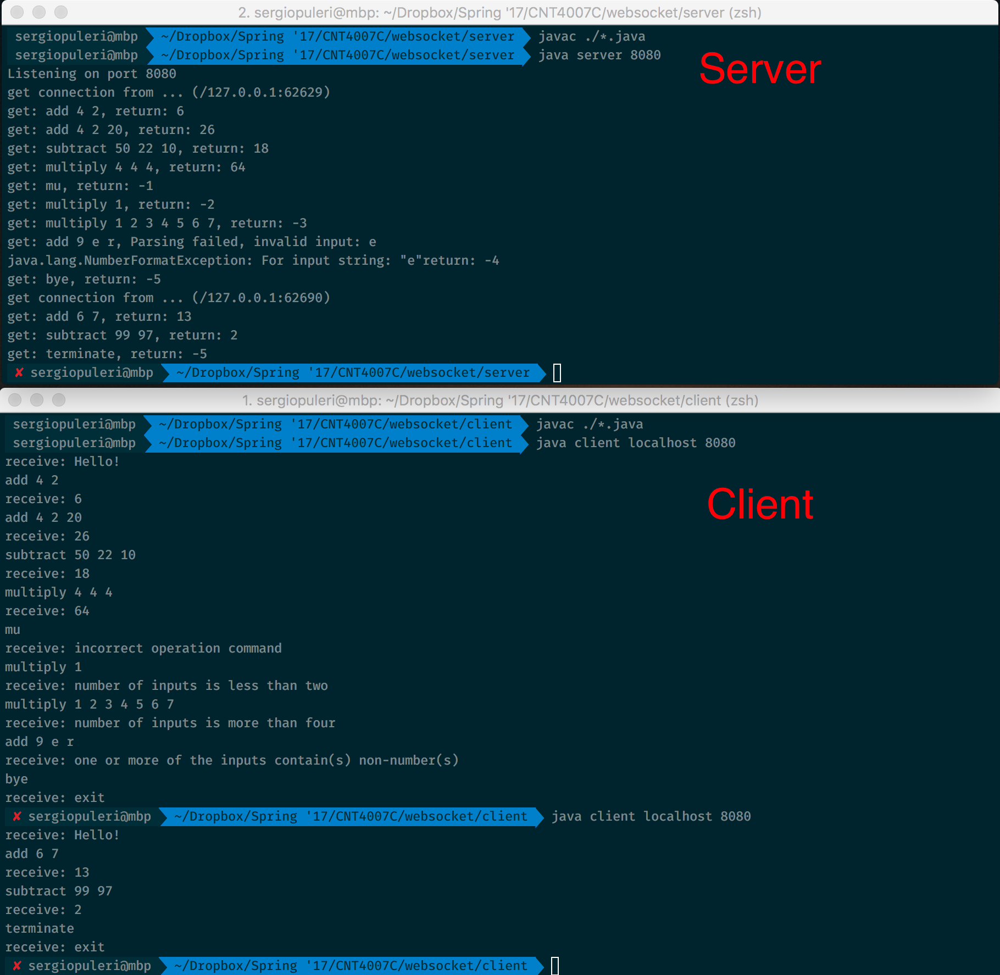

# Websocket Client and Server Program - CNT4007C Spring '17 PA1

Sergio Puleri  
UFID: 2196-3931  
spuleri@ufl.edu

## Compilation (Server) in a Unix Environment
`cd server && javac *.java`

## Compilation (Client) in a Unix Environment
`cd client && javac *.java`

## Run Server
`java server <port number>`  
Ex: `java server 8080`

## Run Client
`java Client <host name> <port number>`  
Ex: `java client localhost 8080`

## Running on UF CISE machines:
- Transfer zip file of source code to machine by your method of choice
- Follow above instructions to compile and run server and client

## Code Structure
There are two directories:
- `/websocket/server/` holds the server program related files
  - `Server.java` is the main driver class for the Server. It creates a new server and begins listening on the desired port.
  - `ServerLogic.java` maintains all of the logic for the server such as:
    - beginning to accept connections
    - initiating communication with a client once a connection is made
    - Processing client messages and computing results
    - Handling errors in client messages
    - Responding accordingly
    - Terminating connections and and listening for new connections
  - `Response.java` is a wrapper class to handle responses to client. This is used to handle different error responses as well as to maintain the result of the computation and to return the appropriate String back to the client.
- `/websocket/client` holds the client program related file.
  - Client.java is the only file and class as the client's responsibilities are quite simple:
    - All functionality is handled in the main function
    - First the client attempts to make a connection to the websocket at the provided hostname and port number
    - If successfully, it opens an out and input stream buffer to communicate with the server
    - Upon receiving the first message from the server, the user of the program is prompted to enter a message from `stdin`
    - This message is sent directly to the server as it was typed in by the user
    - A response is waiting for and we print the response and allow the user to input another command on loop
    - If the server ever responds with "-5" we exit and terminate the process.

## Example Outputs

## Results
All results are as expected from the specifcations in `pa1.pdf`. The server program is able to accept a single websocket connection from one client at a time, perform addition subtraction and multiplication with 2-4 operands, respond with error codes if input is bad, close connection with a client and listen for another connection, and close connection and terminate itself. There are no abnormal results.

There are no bugs, missing items and limitations of the program
